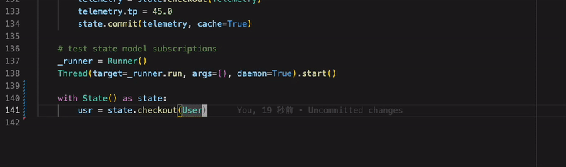

=====
About
=====

*Myosin* is a lightweight framework for developing state-driven software systems. *Myosin* was originally designed to address scaling problems when developing embedded control systems with bidirectional command and control capabilities. Namely between an embedded microcontroller and any number of monitoring services.

Why *Myosin*?
-------------

State-driven architectures allow for the development of more intelligent software components. *Myosin* facilitates system state descriptor communication between software components using the same language. The syntax for communication of data is implemented through the state models which are object-oriented representations of the system state.

Traditionally, embedded systems use `event-driven architectures <https://en.wikipedia.org/wiki/Event-driven_architecture>`_ for synchronizing state changes across multiple software components. Event driven solutions, while simple to implement do not scale well for handling bidirectional data transfer.

For example, picture a typical embedded system with three software components:
#. **UART Interface** - Communicates with a microcontroller
#. **Cloud Link** - Streams telemetry to a cloud service
#. **User Interface Controller** - Updates an embedded GUI. 

The Cloud Link and User Interface operate with their own control loops and digest new telemetry payloads from the ``SENSORFRAME`` event dispatched by the UART Interface. In this model, data integrity is limited as there is no universal reference for the most recent telemetry except from the most recent ``SENSORFRAME`` payload. If the event payload is implemented as a dictionary then unpacking of event payloads is also duplicated across components and not reusable across different event payloads.

The *myosin* framework is modelled off system environment variables. Environment variables are fully permissive and describe the context for a software runtimes. *Myosin* mimics an environment variable manager for strictly typed python objects called ``StateModels`` which describes a component of the software system. A ``StateModel`` such as a (Sensorframe) is registered and loaded into *myosin* as a python object on boot. This object holds properties describing the state. As the UART Interface updates the system with a new sensorframe reading it commits a new sensorframe instance to *myosin*. The advantage of this is that a state has a source of truth. Each module with a control loop can simply get the state from *myosin* by checking out a copy of the active state model.

The major benefit to *myosin* over traditional event-driven solutions is the consistent and typesafe universal access to system state variables.

Core Features
-------------

Fault-Tolerance
~~~~~~~~~~~~~~~
Since all runtime state data handled by *myosin*, it comes equipped with the ability to cache system state objects into persistant storage when a system state model is updated. If the application crashes and restarts, *myosin* will load the previously cached system states recovering the system to its previous state.

Fully Permissive
~~~~~~~~~~~~~~~~
Any software component can access and subscribe to system state models agnostic of your projects hierarchical structure. Simply import *myosin* from anywhere to get access to the systems state descriptors. This allows any individual software components to house custom logic that is informed by the real-time state of the system as a whole.

Custom State Validation
~~~~~~~~~~~~~~~~~~~~~~~
*Myosin* enforces all system state models are python objects. It is strongly encouraged these models are written with property getters and setters to enable custom validation on state model fields. If implemented, software components can fail early trying to set an illegal value in a state model field without affecting the global system state improving the system robustness at runtime.

Thread Safety
~~~~~~~~~~~~~
All system state accessors are fully thread-safe and support concurrent read and write operations. Access to *myosin* state models are done using the deep copies (pass by value) of the source state model so local modification can be done safely.

Lightweight
~~~~~~~~~~~
*Myosin* is programmed exclusively using python's stdlib from 3.7 onwards. The combination of a small dependancy tree and simple implementation improves application security and resiliency.

State-Driven Event Queue
~~~~~~~~~~~~~~~~~~~~~~~~
*Myosin* supports state subscriber callbacks to be scheduled in response to a change to a specific system state. Callbacks must be asynchronous and accept a single parameter for the new system state subscribed to by the callback.

Strictly Typed API
~~~~~~~~~~~~~~~~~~
All *myosin* functions for access and modification to system state variables are strictly typed for intellisense and static type analysis tools like ``Pylance`` making the programming with *myosin* easy and error-free. Type accuracy for state models are left to the developer. It is highly encouraged that all state models loaded into *myosin* are strictly typed with property getters and setters for each field to leverage the full typing capabilities.

