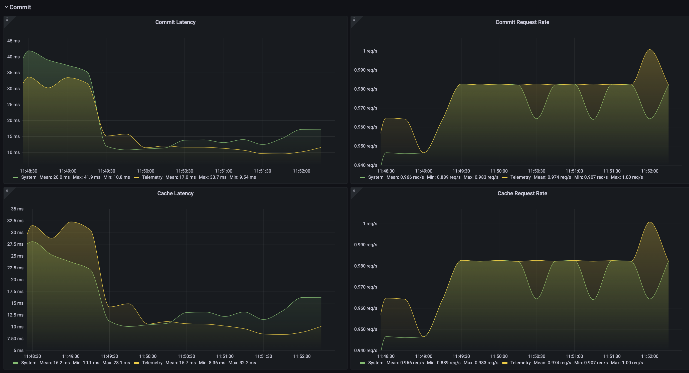

Usage
=====

System Requirements
-------------------

*Myosin* is built for use on embedded linux platforms. Some features of *myosin* are only written for POSIX compliant systems. Cross-platform support for all features is not currently being pursued.

Supported Python Versions
~~~~~~~~~~~~~~~~~~~~~~~~~
The following table outlines the distributions and testing support for *myosin* against different python versions: 

====== =========== =============
Python Distibution Test Suite
====== =========== =============
3.8    Supported   Supported
------ ----------- -------------
3.9    Supported   Supported
------ ----------- -------------
3.10   Supported   Not Supported
====== =========== =============

Installation
------------

The easiest way to install ``Myosin`` is using ``pip``:

.. code-block:: console

   python3 -m pip install myosin

Alternatively you can build from source:

.. code-block:: console

   git clone git@github.com:ztnel/myosin.git
   cd myosin
   python3 -m pip install .

Basic Usage
-----------
Start by defining a model by creating a class that implements ``StateModel``. For example, we may want to track the active user in the application runtime. We define a model ``User`` with properties associated to a user:

.. code-block:: python

   from myosin import StateModel

   class User(StateModel):

      def __init__(self, name: str, email: str) -> None:
         super().__init__()
         self.name = name
         self.email = email

      @property
      def name(self) -> str:
         return self.__name

      @name.setter
      def name(self, name: str) -> None:
         self.__name = name

      @property
      def email(self) -> str:
         return self.__email

      @email.setter
      def email(self, email: str) -> None:
         self.__email = email

      def serialize(self) -> Dict[str, Any]:
         return {
            'id': self.id,
            'name': self.name,
            'email': self.email
         }

      def deserialize(self, **kwargs) -> None:
         for k, v in kwargs.items():
            setattr(self, k, v)

Model Registration
~~~~~~~~~~~~~~~~~~

In the application entry, load the state model into the engine with default property values:

.. code-block:: python

   # create default state
   usr = User(
      name="chris",
      email="chris@email.com"
   )

   # register the model into the state engine
   with State() as state:
      state.load(usr)

This will register an entry for the ``User`` model into the global system state context. If a model with the same type is found in the system cache, *Myosin* will overwrite the model's default property values with those previously cached.

Model Accessors
~~~~~~~~~~~~~~~

In a consumer module you can access the global ``User`` model by checking out a copy of the model:

.. note:: 
   Thread-safe access to the ``User`` model is facilitated by passing the model type as an argument to the ``State`` context to request a mutex specific to the model.

.. code-block:: python

   with State(User) as state:
      # checkout a copy of the user state model
      user = state.checkout(User)
   # read properties from the user state model
   logging.info("Username: %s", user.name)

In a producer module you can commit to the global ``User`` model by first checking out a copy of the model, modifying it and requesting a commit:

.. code-block:: python

   with State(User) as state:
      # checkout a copy of the user state model
      user = state.checkout(User)
      # modify user state model copy
      user.name = "cS"
      # commit the modified copy
      state.commit(user)

Advanced Usage
--------------

Prometheus Metrics
~~~~~~~~~~~~~~~~~~
*Myosin* uses the prometheus client python library to export performance metrics to a *Prometheus* instance. *Prometheus* enables real-time monitoring of your application and provides insights into the system performance to aid in optimization and debugging. You can learn more about prometheus at their website `<https://prometheus.io>`_. The table below describes the exported metrics:

+-------------------------+--------------------------------------------------------------------------------------------------------------------------------+---------+
| Name                    | Description                                                                                                                    | Type    |
+=========================+================================================================================================================================+=========+
| myosin_meta             | Installation metadata of the current myosin distribution                                                                       | Info    |
+-------------------------+--------------------------------------------------------------------------------------------------------------------------------+---------+
| myosin_active_contexts  | Number of active threads inside state context manager                                                                          | Gauge   |
+-------------------------+--------------------------------------------------------------------------------------------------------------------------------+---------+
| myosin_cb_exc_count     | Running counter of subscription callback exceptions                                                                            | Counter |
+-------------------------+--------------------------------------------------------------------------------------------------------------------------------+---------+
| myosin_commit_latency   | Latency of state commit invocations. Divides total number of commit requests by the total time spent performing commits.       | Summary |
+-------------------------+--------------------------------------------------------------------------------------------------------------------------------+---------+
| myosin_cache_latency    | Latency of state caching invocations. Divides total number of cache requests by the total time spent performing caches.        | Summary |
+-------------------------+--------------------------------------------------------------------------------------------------------------------------------+---------+
| myosin_checkout_latency | Latency of state checkout invocations. Divides total number of checkout requests by the total time spent performing checkouts. | Summary |
+-------------------------+--------------------------------------------------------------------------------------------------------------------------------+---------+

The github repository hosts an example program which demonstrates usage of the framework and provides a Grafana dashboard and some basic queries for visualizing these metrics.

Developer Tips
--------------

Thread Safety
~~~~~~~~~~~~~
In multi-threaded environments it is best practice to perform system state model checkouts and commits inside the same locked state context. Each model is assigned a mutex for synchronizing access. The state context requests a mutex for the resource passed into the state context on entry ensuring the checkout copy is the most recent. Below is an example of undefined behaviour:

.. code-block:: python

   # `User` lock requested on entry
   with State(User) as state:
      user = state.checkout(User)
   # `User` lock released; model may no longer be up to date
   user.email = "mike@gmail.com"
   with State(User) as state:
      # overwrite user model with local copy
      state.commit(user)

.. warning::
   This code block is an example of undefined behaviour. The ``User`` model is modified outside the state context and may no longer be up to date. Commiting this model to the state may overwrite more recent changes made to the user model.

.. code-block:: python

   with State(User) as state:
      user = state.checkout(User)
      user.email = "mike@gmail.com"
      state.commit(user)

Reducing Latency
~~~~~~~~~~~~~~~~
The primary cause of latency is due to long mutex acquisition times. Time spent inside critical sections of should be kept to a minimum. Avoid long blocking function calls while within a locked state context:

.. code-block:: python
   
   with State(User) as state:
      user = state.checkout(User)
      # `User` mutex continually held during long blocking call
      user.email = long_blocking_transaction()
      state.commit(user)

Long blocking function calls should be buffered outside the state context:

.. code-block:: python

   email = long_blocking_transaction()
   with State(User) as state:
      user = state.checkout(User)
      user.email = 
      state.commit(user)

Logging
~~~~~~~
Logging state data transactions is critical for debugging. All models implement a pretty print json format which makes it easy to read the state model properties in the logging output. Logging any state model is as easy as passing it to a string formatter:

.. code-block:: python

   with State(User) as state:
      # checkout a copy of the user state model
      user = state.checkout(User)
      # modify user state model copy
      user.name = "cS"
      logger.info("User: %s", user)

This will yield a logging output which will resemble a json document:

.. code-block:: console

   User:
   {
      "id": "d6c9e2b4-f07a-4ae4-b36f-30e49739085b",
      "name": "cS",
      "timestamp": 1661661213.072657
   }

Testing
-------

Unittests can be executed locally by cloning ``myosin`` and installing the testing requirements:

.. code-block:: console

   git clone git@github.com:ztnel/myosin.git
   cd myosin
   python3 -m pip install tests/requirements.txt

Run the tests using the ``nosetests`` utility:

.. code-block:: console

   nosetests

.. warning::
   The ``nosetests`` utility is no longer maintained and has compatibility issues with Python 3.10 as noted by this `issue thread <https://github.com/nose-devs/nose/issues/1099>`_. Therefore *myosin* unittests will not be executable on Python 3.10.

   I am looking to migrate to pytest and would love contributor support in unittesting.

The test runner will report the executed tests and generate a coverage report. The coverage goal for this library is 95% or greater. If you want to contribute and don't know how, this is a great place to start.
